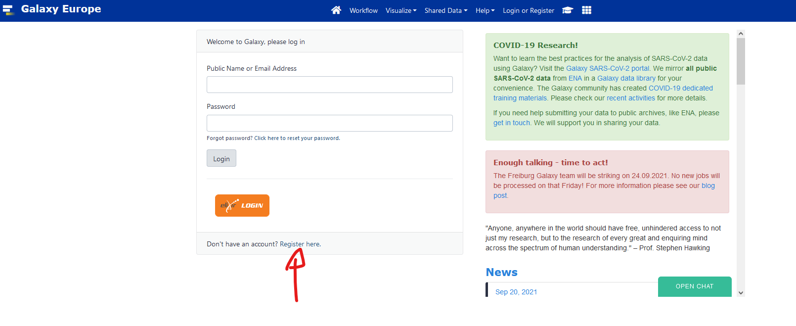
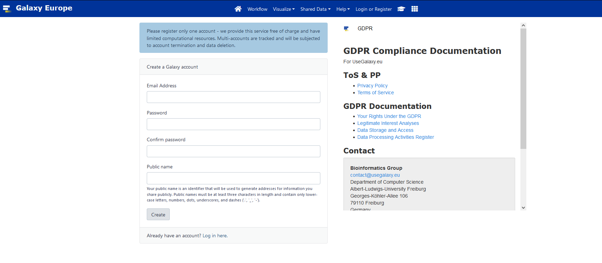

# Genome Annotation

## Schedule:

### **Day 1**
* Morning: 
    1. Introduction to Galaxy [Part1](https://training.galaxyproject.org/training-material/topics/introduction/tutorials/galaxy-intro-short/tutorial.html) and [Part2](https://training.galaxyproject.org/training-material/topics/galaxy-interface/tutorials/upload-rules/tutorial.html)
    2. Presentation Prokaryotic annotation [here](usage/proka_annot.md)
    3. Prokaryotic annotation practice [here](usage/proka_annot.md)
* Afternoon: 
    1. Prokaryotic annotation practice [here](usage/proka_annot.md)

### **Day 2**
* Morning: 
    1. Presentation Eukaryotic annotation [here](usage/euka_annot.md)
    2. Eukaryotic annotation practice [here](usage/euka_annot.md)
* Afternoon: 
    1. Eukaryotic annotation practice [here](usage/euka_annot.md)

### **Day 3** 

[here](usage/project.md)

* Morning: 
    1. All-round genome annotation presentation
    2. Beginning Project
* Afternoon: 
    1. Project work

### **Day 4**

[here](usage/project.md)

* Morning: 
    1. Project work
* Afternoon: 
    1. Presentation of project

## Galaxy

### Galaxy set up

1. Register to [usegalaxy.eu](http://usegalaxy.eu/).






2. Click the verification link you will receive by email.

3. Go to this [link](https://usegalaxy.eu/join-training/heh-genome) to join our training session. 
It should say you successfully registered in HEHANNOT


### Galaxy introduction

Slides [here](https://training.galaxyproject.org/training-material/topics/introduction/tutorials/galaxy-intro-short/slides.html#1)

We will follow this [tutorial](https://training.galaxyproject.org/training-material/topics/introduction/tutorials/galaxy-intro-short/tutorial.html)

## Bioconda and Conda installation

We will follow the installation recommended by bioconda [directly](https://bioconda.github.io/user/install.html)

### Installation of bioconda

1. Install conda

Bioconda requires the conda package manager to be installed. If you have an Anaconda Python installation, you already have it. Otherwise, the best way to install it is with the Miniconda package. The Python 3 version is recommended.

On MacOS, run:

```bash
curl -O https://repo.anaconda.com/miniconda/Miniconda3-latest-MacOSX-x86_64.sh
sh Miniconda3-latest-MacOSX-x86_64.sh
```

On Linux, run:

```bash
curl -O https://repo.anaconda.com/miniconda/Miniconda3-latest-Linux-x86_64.sh
sh Miniconda3-latest-Linux-x86_64.sh
```

Follow the instructions in the installer. If you encounter problems, refer to the Miniconda [documentation](https://conda.io/en/latest/miniconda.html).


2. Set up channels

After installing conda you will need to add the bioconda channel as well as the other channels bioconda depends on. It is important to add them in this order so that the priority is set correctly (that is, conda-forge is highest priority).

The conda-forge channel contains many general-purpose packages not already found in the defaults channel.

```bash
conda config --add channels defaults
conda config --add channels bioconda
conda config --add channels conda-forge
```

3. Install packages

Browse the packages to see what’s available.

Bioconda is now enabled, so any packages on the bioconda channel can be installed into the current conda environment:

```bash
conda install bwa
```

Or a new environment can be created:

```bash
conda create -n aligners bwa bowtie hisat star
```

!!!! if you are on ubuntu in WSL you might get an HTTP error, to solve it a simple reboot of your computer is enough.!!!!

### Tutorial, guides, and CheatSheet

Here is a collection of materials to train and improve your conda use. All have their strength and weaknesses, the cheatsheet is your best friend when working.

* [NBIS tutorial](https://nbis-reproducible-research.readthedocs.io/en/course_2104/conda/)
* [Guide by Matthew Sarmiento](https://towardsdatascience.com/a-guide-to-conda-environments-bc6180fc533)
* [Guide by Whitebox](https://whiteboxml.com/blog/the-definitive-guide-to-python-virtual-environments-with-conda)
* [CheatSheet](https://docs.conda.io/projects/conda/en/4.6.0/_downloads/52a95608c49671267e40c689e0bc00ca/conda-cheatsheet.pdf)

## Grade breakdown

* 40% Active participation
* 20% Project report
* 40% Project presentation and discussion
