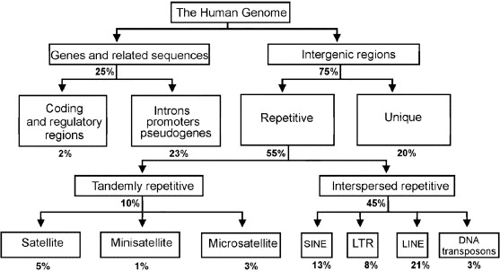

# Genome Annotation
# **Eukaryotic**

## Lecture

If you want to access the [slides](https://training.galaxyproject.org/training-material/topics/genome-annotation/slides/introduction.html#1) 

## Pratice

### 1. Masking repeats with Repeat Masker 

[Here](https://training.galaxyproject.org/training-material/topics/genome-annotation/tutorials/repeatmasker/tutorial.html)

### 2. Annotation with Maker

[here](https://training.galaxyproject.org/training-material/topics/genome-annotation/tutorials/annotation-with-maker/tutorial.html) 

## Composition Human Genome

Source [https://doi.org/10.1016/j.febslet.2004.03.109](https://doi.org/10.1016/j.febslet.2004.03.109)

## Bonus Refining the Maker annotation

The tutorial is available [Here](https://training.galaxyproject.org/training-material/topics/genome-annotation/tutorials/apollo-euk/tutorial.html)

## Bonus annotation with Funannotate

The tutorial is available [Here](https://training.galaxyproject.org/training-material/topics/genome-annotation/tutorials/funannotate/tutorial.html)
